# THIẾT KẾ HỆ THỐNG HỌC TẬP TRỰC TUYẾN (E-LEARNING SYSTEM)

> Tài liệu thiết kế chi tiết theo chuẩn UML với mã Mermaid. Bao gồm: Use Case, Class, ER Database, Sequence, Package, Component, State, Activity Diagrams.

---

## 1. TỔNG QUAN HỆ THỐNG

### 1.1. Mô tả nghiệp vụ

Hệ thống học tập trực tuyến cho phép:

- **Giảng viên (Instructor)**: tạo khóa học, đăng video bài giảng, tài liệu PDF, trả lời chat 1-1 với học viên, trả lời câu hỏi nhanh theo từng đoạn video/trang tài liệu, đăng bài cộng đồng, xem thống kê doanh thu/người học.
- **Học viên (Student)**: duyệt khóa học, thanh toán đăng ký, xem video, ghi note theo timestamp/trang, đặt câu hỏi nhanh tại vị trí cụ thể, chat 1-1 với giảng viên, tham gia cộng đồng khóa học (đăng bài hỏi/thảo luận).
- **Admin**: quản lý người dùng, kiểm duyệt khóa học, kiểm duyệt nội dung cộng đồng, xem thống kê toàn hệ thống, quản lý thanh toán/hoàn tiền.
- **Mở rộng tương lai**: Live stream (giảng viên phát trực tiếp, học viên đã enroll xem real-time).

### 1.2. Kiến trúc tổng thể (High-level Architecture)

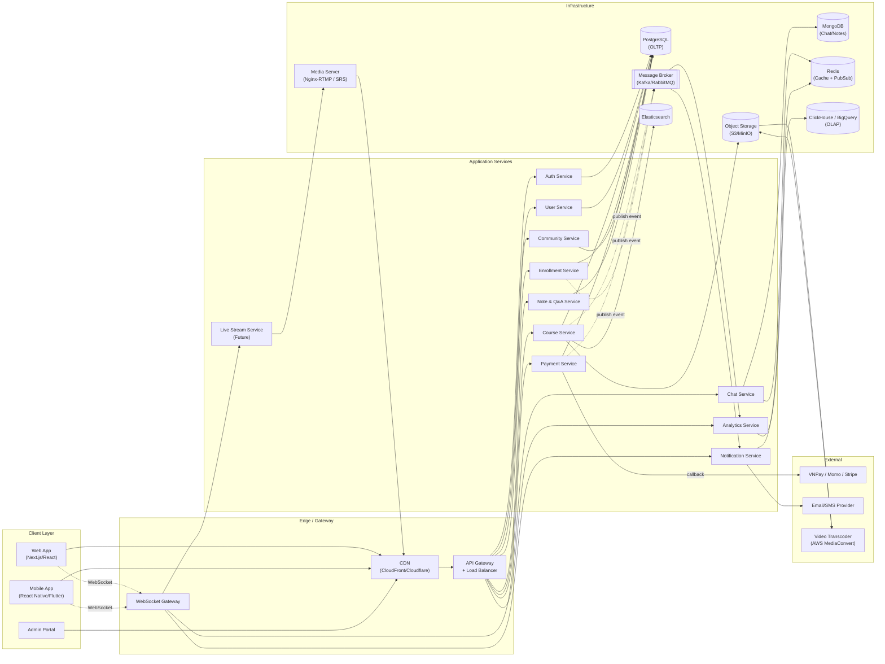
```mermaid
flowchart LR
    subgraph Client["Client Layer"]
        WebApp["Web App<br/>(Next.js/React)"]
        MobileApp["Mobile App<br/>(React Native/Flutter)"]
        AdminPortal["Admin Portal"]
    end

    subgraph Edge["Edge / Gateway"]
        CDN["CDN<br/>(CloudFront/Cloudflare)"]
        Gateway["API Gateway<br/>+ Load Balancer"]
        WSGateway["WebSocket Gateway"]
    end

    subgraph Services["Application Services"]
        Auth["Auth Service"]
        User["User Service"]
        Course["Course Service"]
        Enroll["Enrollment Service"]
        Pay["Payment Service"]
        Chat["Chat Service"]
        Note["Note & Q&A Service"]
        Comm["Community Service"]
        Notif["Notification Service"]
        Stream["Live Stream Service<br/>(Future)"]
        Analytics["Analytics Service"]
    end

    subgraph Infra["Infrastructure"]
        Postgres[("PostgreSQL<br/>(OLTP)")]
        Mongo[("MongoDB<br/>(Chat/Notes)")]
        Redis[("Redis<br/>(Cache + PubSub)")]
        S3[("Object Storage<br/>(S3/MinIO)")]
        Kafka[["Message Broker<br/>(Kafka/RabbitMQ)"]]
        Search[("Elasticsearch")]
        Warehouse[("ClickHouse / BigQuery<br/>(OLAP)")]
        Media["Media Server<br/>(Nginx-RTMP / SRS)"]
    end

    subgraph External["External"]
        VNPay["VNPay / Momo / Stripe"]
        Email["Email/SMS Provider"]
        Transcoder["Video Transcoder<br/>(AWS MediaConvert)"]
    end

    WebApp --> CDN
    MobileApp --> CDN
    AdminPortal --> CDN
    CDN --> Gateway
    WebApp -.WebSocket.-> WSGateway
    MobileApp -.WebSocket.-> WSGateway

    Gateway --> Auth & User & Course & Enroll & Pay & Note & Comm & Analytics
    WSGateway --> Chat
    WSGateway --> Stream
    WSGateway --> Notif

    Auth & User --> Postgres
    Course & Enroll --> Postgres
    Pay --> Postgres
    Comm --> Postgres
    Note --> Postgres
    Chat --> Mongo
    Chat --> Redis
    Notif --> Redis
    Analytics --> Warehouse
    Course --> Search

    Course --> S3
    Stream --> Media
    Media --> CDN

    Pay -->|callback| VNPay
    Notif --> Email

    Course -. publish event .-> Kafka
    Pay -. publish event .-> Kafka
    Enroll -. publish event .-> Kafka
    Kafka --> Notif
    Kafka --> Analytics

    S3 --> Transcoder
    Transcoder --> S3
```

---

## 2. SƠ ĐỒ USE CASE

### 2.1. Tổng thể (System-level Use Case)

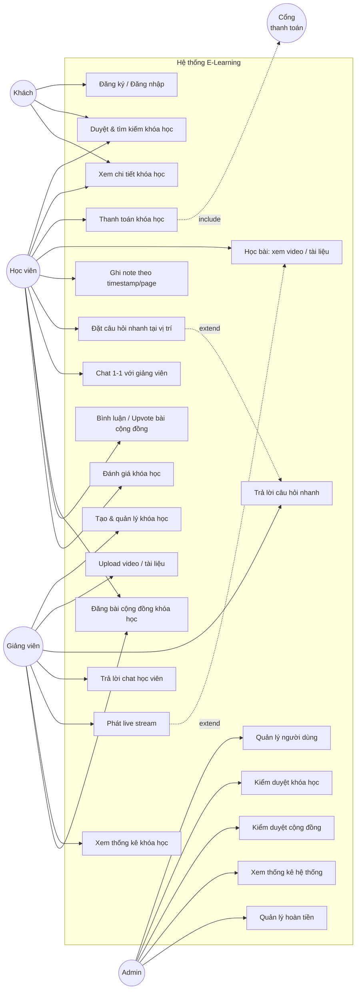
```mermaid
flowchart LR
    Guest((Khách))
    Student((Học viên))
    Instructor((Giảng viên))
    Admin((Admin))
    Gateway((Cổng<br/>thanh toán))

    subgraph SYS["Hệ thống E-Learning"]
        UC1[Đăng ký / Đăng nhập]
        UC2[Duyệt & tìm kiếm khóa học]
        UC3[Xem chi tiết khóa học]
        UC4[Thanh toán khóa học]
        UC5[Học bài: xem video / tài liệu]
        UC6[Ghi note theo timestamp/page]
        UC7[Đặt câu hỏi nhanh tại vị trí]
        UC8[Chat 1-1 với giảng viên]
        UC9[Đăng bài cộng đồng khóa học]
        UC10[Bình luận / Upvote bài cộng đồng]
        UC11[Đánh giá khóa học]

        UC20[Tạo & quản lý khóa học]
        UC21[Upload video / tài liệu]
        UC22[Trả lời câu hỏi nhanh]
        UC23[Trả lời chat học viên]
        UC24[Phát live stream]
        UC25[Xem thống kê khóa học]

        UC30[Quản lý người dùng]
        UC31[Kiểm duyệt khóa học]
        UC32[Kiểm duyệt cộng đồng]
        UC33[Xem thống kê hệ thống]
        UC34[Quản lý hoàn tiền]
    end

    Guest --> UC1
    Guest --> UC2
    Guest --> UC3

    Student --> UC2 & UC3 & UC4 & UC5 & UC6 & UC7 & UC8 & UC9 & UC10 & UC11
    Instructor --> UC20 & UC21 & UC22 & UC23 & UC24 & UC25 & UC9
    Admin --> UC30 & UC31 & UC32 & UC33 & UC34

    UC4 -. include .-> Gateway
    UC7 -. extend .-> UC22
    UC24 -. extend .-> UC5
```

### 2.2. Use Case chi tiết — Module Học bài

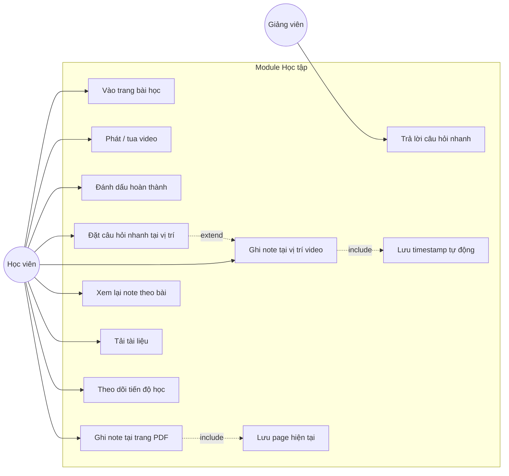
```mermaid
flowchart LR
    Student((Học viên))
    Instructor((Giảng viên))

    subgraph LEARN["Module Học tập"]
        L1[Vào trang bài học]
        L2[Phát / tua video]
        L3[Đánh dấu hoàn thành]
        L4[Ghi note tại vị trí video]
        L5[Ghi note tại trang PDF]
        L6[Đặt câu hỏi nhanh tại vị trí]
        L7[Xem lại note theo bài]
        L8[Tải tài liệu]
        L9[Trả lời câu hỏi nhanh]
        L10[Theo dõi tiến độ học]

        L4 -.include.-> L11[Lưu timestamp tự động]
        L5 -.include.-> L12[Lưu page hiện tại]
        L6 -.extend.-> L4
    end

    Student --> L1 & L2 & L3 & L4 & L5 & L6 & L7 & L8 & L10
    Instructor --> L9
```

---

## 3. SƠ ĐỒ CLASS (Domain Model)

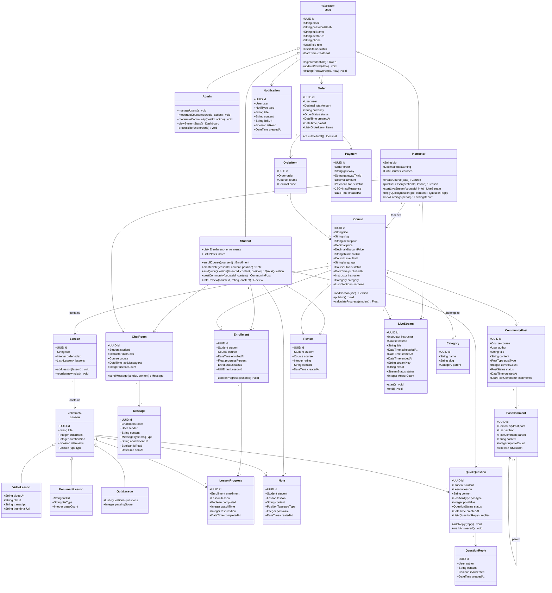
```mermaid
classDiagram
    class User {
        <<abstract>>
        +UUID id
        +String email
        +String passwordHash
        +String fullName
        +String avatarUrl
        +String phone
        +UserRole role
        +UserStatus status
        +DateTime createdAt
        +login(credentials) Token
        +updateProfile(data) void
        +changePassword(old, new) void
    }

    class Student {
        +List~Enrollment~ enrollments
        +List~Note~ notes
        +enrollCourse(courseId) Enrollment
        +createNote(lessonId, content, position) Note
        +askQuickQuestion(lessonId, content, position) QuickQuestion
        +postCommunity(courseId, content) CommunityPost
        +rateReview(courseId, rating, content) Review
    }

    class Instructor {
        +String bio
        +Decimal totalEarning
        +List~Course~ courses
        +createCourse(data) Course
        +publishLesson(sectionId, lesson) Lesson
        +startLiveStream(courseId, info) LiveStream
        +replyQuickQuestion(qId, content) QuestionReply
        +viewEarnings(period) EarningReport
    }

    class Admin {
        +manageUsers() void
        +moderateCourse(courseId, action) void
        +moderateCommunity(postId, action) void
        +viewSystemStats() Dashboard
        +processRefund(orderId) void
    }

    class Course {
        +UUID id
        +String title
        +String slug
        +String description
        +Decimal price
        +Decimal discountPrice
        +String thumbnailUrl
        +CourseLevel level
        +String language
        +CourseStatus status
        +DateTime publishedAt
        +Instructor instructor
        +Category category
        +List~Section~ sections
        +addSection(title) Section
        +publish() void
        +calculateProgress(student) Float
    }

    class Section {
        +UUID id
        +String title
        +Integer orderIndex
        +List~Lesson~ lessons
        +addLesson(lesson) void
        +reorder(newIndex) void
    }

    class Lesson {
        <<abstract>>
        +UUID id
        +String title
        +Integer orderIndex
        +Integer durationSec
        +Boolean isPreview
        +LessonType type
    }

    class VideoLesson {
        +String videoUrl
        +String hlsUrl
        +String transcript
        +String thumbnailUrl
    }

    class DocumentLesson {
        +String fileUrl
        +String fileType
        +Integer pageCount
    }

    class QuizLesson {
        +List~Question~ questions
        +Integer passingScore
    }

    class Enrollment {
        +UUID id
        +Student student
        +Course course
        +DateTime enrolledAt
        +Float progressPercent
        +EnrollStatus status
        +UUID lastLessonId
        +updateProgress(lessonId) void
    }

    class LessonProgress {
        +UUID id
        +Enrollment enrollment
        +Lesson lesson
        +Boolean completed
        +Integer watchTime
        +Integer lastPosition
        +DateTime completedAt
    }

    class Note {
        +UUID id
        +Student student
        +Lesson lesson
        +String content
        +PositionType posType
        +Integer posValue
        +DateTime createdAt
    }

    class QuickQuestion {
        +UUID id
        +Student student
        +Lesson lesson
        +String content
        +PositionType posType
        +Integer posValue
        +QuestionStatus status
        +DateTime createdAt
        +List~QuestionReply~ replies
        +addReply(reply) void
        +markAnswered() void
    }

    class QuestionReply {
        +UUID id
        +User author
        +String content
        +Boolean isAccepted
        +DateTime createdAt
    }

    class ChatRoom {
        +UUID id
        +Student student
        +Instructor instructor
        +Course course
        +DateTime lastMessageAt
        +Integer unreadCount
        +sendMessage(sender, content) Message
    }

    class Message {
        +UUID id
        +ChatRoom room
        +User sender
        +String content
        +MessageType msgType
        +String attachmentUrl
        +Boolean isRead
        +DateTime sentAt
    }

    class CommunityPost {
        +UUID id
        +Course course
        +User author
        +String title
        +String content
        +PostType postType
        +Integer upvoteCount
        +PostStatus status
        +DateTime createdAt
        +List~PostComment~ comments
    }

    class PostComment {
        +UUID id
        +CommunityPost post
        +User author
        +PostComment parent
        +String content
        +Integer upvoteCount
        +Boolean isSolution
    }

    class Order {
        +UUID id
        +User user
        +Decimal totalAmount
        +String currency
        +OrderStatus status
        +DateTime createdAt
        +DateTime paidAt
        +List~OrderItem~ items
        +calculateTotal() Decimal
    }

    class OrderItem {
        +UUID id
        +Order order
        +Course course
        +Decimal price
    }

    class Payment {
        +UUID id
        +Order order
        +String gateway
        +String gatewayTxnId
        +Decimal amount
        +PaymentStatus status
        +JSON rawResponse
        +DateTime createdAt
    }

    class Review {
        +UUID id
        +Student student
        +Course course
        +Integer rating
        +String content
        +DateTime createdAt
    }

    class LiveStream {
        +UUID id
        +Instructor instructor
        +Course course
        +String title
        +DateTime scheduledAt
        +DateTime startedAt
        +DateTime endedAt
        +String streamKey
        +String hlsUrl
        +StreamStatus status
        +Integer viewerCount
        +start() void
        +end() void
    }

    class Notification {
        +UUID id
        +User user
        +NotifType type
        +String title
        +String content
        +String linkUrl
        +Boolean isRead
        +DateTime createdAt
    }

    class Category {
        +UUID id
        +String name
        +String slug
        +Category parent
    }

    User <|-- Student
    User <|-- Instructor
    User <|-- Admin

    Lesson <|-- VideoLesson
    Lesson <|-- DocumentLesson
    Lesson <|-- QuizLesson

    Instructor "1" --> "*" Course : teaches
    Course "1" --> "*" Section : contains
    Section "1" --> "*" Lesson : contains
    Course "*" --> "1" Category : belongs to

    Student "1" --> "*" Enrollment
    Course "1" --> "*" Enrollment
    Enrollment "1" --> "*" LessonProgress
    Lesson "1" --> "*" LessonProgress

    Student "1" --> "*" Note
    Lesson "1" --> "*" Note

    Student "1" --> "*" QuickQuestion
    Lesson "1" --> "*" QuickQuestion
    QuickQuestion "1" --> "*" QuestionReply

    Student "1" --> "1" ChatRoom
    Instructor "1" --> "*" ChatRoom
    ChatRoom "1" --> "*" Message

    Course "1" --> "*" CommunityPost
    CommunityPost "1" --> "*" PostComment
    PostComment "0..1" --> "*" PostComment : parent

    User "1" --> "*" Order
    Order "1" --> "*" OrderItem
    OrderItem "*" --> "1" Course
    Order "1" --> "1" Payment

    Student "1" --> "*" Review
    Course "1" --> "*" Review

    Instructor "1" --> "*" LiveStream
    Course "1" --> "*" LiveStream

    User "1" --> "*" Notification
```

---

## 4. THIẾT KẾ DATABASE

### 4.1. ER Diagram


```mermaid
erDiagram
    USERS ||--o{ ENROLLMENTS : has
    USERS ||--o{ ORDERS : places
    USERS ||--o{ NOTIFICATIONS : receives
    USERS ||--o{ COMMUNITY_POSTS : authors
    USERS ||--o{ POST_COMMENTS : authors
    USERS ||--o{ MESSAGES : sends
    USERS ||--o{ COURSES : teaches
    USERS ||--o{ REVIEWS : writes
    USERS ||--o{ NOTES : owns
    USERS ||--o{ QUICK_QUESTIONS : asks
    USERS ||--o{ QUESTION_REPLIES : posts

    CATEGORIES ||--o{ CATEGORIES : parent
    CATEGORIES ||--o{ COURSES : classifies

    COURSES ||--o{ SECTIONS : contains
    COURSES ||--o{ ENROLLMENTS : has
    COURSES ||--o{ COMMUNITY_POSTS : community
    COURSES ||--o{ REVIEWS : reviewed
    COURSES ||--o{ LIVE_STREAMS : streamed
    COURSES ||--o{ ORDER_ITEMS : sold
    COURSES ||--o{ CHAT_ROOMS : context

    SECTIONS ||--o{ LESSONS : contains

    LESSONS ||--o| VIDEO_ASSETS : has
    LESSONS ||--o| DOCUMENT_ASSETS : has
    LESSONS ||--o{ LESSON_PROGRESS : tracks
    LESSONS ||--o{ NOTES : annotated
    LESSONS ||--o{ QUICK_QUESTIONS : asked

    ENROLLMENTS ||--o{ LESSON_PROGRESS : progresses

    QUICK_QUESTIONS ||--o{ QUESTION_REPLIES : has

    CHAT_ROOMS ||--o{ MESSAGES : holds

    COMMUNITY_POSTS ||--o{ POST_COMMENTS : has
    COMMUNITY_POSTS ||--o{ POST_VOTES : voted
    POST_COMMENTS ||--o{ POST_COMMENTS : parent

    ORDERS ||--o{ ORDER_ITEMS : contains
    ORDERS ||--|| PAYMENTS : settled

    USERS {
        uuid id PK
        string email UK
        string password_hash
        string full_name
        string avatar_url
        string phone
        string role "student|instructor|admin"
        string status "active|locked|deleted"
        text bio
        timestamp created_at
        timestamp updated_at
    }

    CATEGORIES {
        uuid id PK
        string name
        string slug UK
        uuid parent_id FK
        text description
    }

    COURSES {
        uuid id PK
        uuid instructor_id FK
        uuid category_id FK
        string title
        string slug UK
        text description
        text short_description
        decimal price
        decimal discount_price
        string thumbnail_url
        string level "beginner|intermediate|advanced"
        string language
        string status "draft|pending|published|archived|rejected"
        decimal avg_rating
        int total_students
        int total_lessons
        int total_duration_sec
        timestamp created_at
        timestamp published_at
    }

    SECTIONS {
        uuid id PK
        uuid course_id FK
        string title
        int order_index
        timestamp created_at
    }

    LESSONS {
        uuid id PK
        uuid section_id FK
        string title
        text description
        string type "video|document|quiz"
        int order_index
        int duration_sec
        boolean is_preview
        timestamp created_at
    }

    VIDEO_ASSETS {
        uuid id PK
        uuid lesson_id FK
        string video_url
        string hls_url
        string thumbnail_url
        text transcript
        int duration_sec
        string processing_status
    }

    DOCUMENT_ASSETS {
        uuid id PK
        uuid lesson_id FK
        string file_url
        string file_type "pdf|docx|slide"
        int page_count
        bigint file_size
    }

    ENROLLMENTS {
        uuid id PK
        uuid student_id FK
        uuid course_id FK
        timestamp enrolled_at
        float progress_percent
        uuid last_lesson_id
        string status "active|completed|cancelled"
    }

    LESSON_PROGRESS {
        uuid id PK
        uuid enrollment_id FK
        uuid lesson_id FK
        boolean completed
        int watch_time_sec
        int last_position_sec
        timestamp completed_at
        timestamp updated_at
    }

    NOTES {
        uuid id PK
        uuid student_id FK
        uuid lesson_id FK
        text content
        string position_type "video_timestamp|document_page|none"
        int position_value
        timestamp created_at
        timestamp updated_at
    }

    QUICK_QUESTIONS {
        uuid id PK
        uuid student_id FK
        uuid lesson_id FK
        text content
        string position_type "video_timestamp|document_page|none"
        int position_value
        string status "pending|answered|closed"
        boolean is_public
        timestamp created_at
        timestamp answered_at
    }

    QUESTION_REPLIES {
        uuid id PK
        uuid question_id FK
        uuid author_id FK
        text content
        boolean is_accepted
        timestamp created_at
    }

    CHAT_ROOMS {
        uuid id PK
        uuid student_id FK
        uuid instructor_id FK
        uuid course_id FK
        timestamp last_message_at
        timestamp created_at
    }

    MESSAGES {
        uuid id PK
        uuid chat_room_id FK
        uuid sender_id FK
        text content
        string message_type "text|image|file|system"
        string attachment_url
        boolean is_read
        timestamp sent_at
    }

    COMMUNITY_POSTS {
        uuid id PK
        uuid course_id FK
        uuid author_id FK
        string title
        text content
        string post_type "question|discussion|announcement"
        int upvote_count
        int comment_count
        string status "active|hidden|deleted"
        boolean is_pinned
        timestamp created_at
    }

    POST_COMMENTS {
        uuid id PK
        uuid post_id FK
        uuid author_id FK
        uuid parent_comment_id FK
        text content
        int upvote_count
        boolean is_solution
        timestamp created_at
    }

    POST_VOTES {
        uuid id PK
        uuid post_id FK
        uuid user_id FK
        string vote_type "up|down"
        timestamp created_at
    }

    ORDERS {
        uuid id PK
        uuid user_id FK
        decimal total_amount
        string currency
        string status "pending|paid|failed|cancelled|refunded"
        string payment_method
        string discount_code
        decimal discount_amount
        timestamp created_at
        timestamp paid_at
    }

    ORDER_ITEMS {
        uuid id PK
        uuid order_id FK
        uuid course_id FK
        decimal price
        decimal discount
    }

    PAYMENTS {
        uuid id PK
        uuid order_id FK
        string gateway "vnpay|momo|stripe|paypal"
        string gateway_txn_id
        decimal amount
        string currency
        string status "initiated|success|failed|refunded"
        json raw_response
        timestamp created_at
    }

    REVIEWS {
        uuid id PK
        uuid student_id FK
        uuid course_id FK
        int rating
        text content
        timestamp created_at
    }

    LIVE_STREAMS {
        uuid id PK
        uuid instructor_id FK
        uuid course_id FK
        string title
        text description
        timestamp scheduled_at
        timestamp started_at
        timestamp ended_at
        string stream_key
        string rtmp_url
        string hls_url
        string status "scheduled|live|ended|cancelled"
        int peak_viewers
        string recording_url
    }

    NOTIFICATIONS {
        uuid id PK
        uuid user_id FK
        string type
        string title
        text content
        string link_url
        json metadata
        boolean is_read
        timestamp created_at
    }
```

### 4.2. Mô tả các bảng chính

| Nhóm | Bảng | Vai trò |
|------|------|---------|
| **Identity** | `users`, `categories` | Người dùng đa vai trò + phân loại khóa học |
| **Catalog** | `courses`, `sections`, `lessons`, `video_assets`, `document_assets` | Cấu trúc khóa học - chương - bài; tách riêng asset video/document để dễ mở rộng |
| **Learning** | `enrollments`, `lesson_progress` | Theo dõi đăng ký và tiến độ từng bài |
| **Note & QnA** | `notes`, `quick_questions`, `question_replies` | Ghi chú và câu hỏi nhanh có gắn `position_type` + `position_value` (giây video hoặc số trang) |
| **Chat 1-1** | `chat_rooms`, `messages` | Phòng chat riêng giữa 1 học viên và 1 giảng viên (theo course context) |
| **Community** | `community_posts`, `post_comments`, `post_votes` | Diễn đàn bên trong từng khóa học |
| **Commerce** | `orders`, `order_items`, `payments` | Đơn hàng, item, giao dịch cổng thanh toán |
| **Feedback** | `reviews` | Đánh giá khóa học |
| **Live (future)** | `live_streams` | Phát trực tiếp - đã chuẩn bị schema sẵn |
| **System** | `notifications` | Thông báo cho người dùng |

### 4.3. Index & ràng buộc quan trọng

- `enrollments`: UNIQUE (`student_id`, `course_id`) — mỗi học viên chỉ enroll 1 lần/khóa.
- `chat_rooms`: UNIQUE (`student_id`, `instructor_id`, `course_id`) — đảm bảo phòng chat riêng theo cặp + ngữ cảnh khóa học.
- `lesson_progress`: UNIQUE (`enrollment_id`, `lesson_id`).
- `reviews`: UNIQUE (`student_id`, `course_id`).
- `post_votes`: UNIQUE (`post_id`, `user_id`).
- Indexes phục vụ truy vấn nóng: `messages(chat_room_id, sent_at DESC)`, `notes(student_id, lesson_id)`, `quick_questions(lesson_id, status)`, `community_posts(course_id, created_at DESC)`, `lesson_progress(enrollment_id, completed)`.
- Soft delete: dùng cột `status` thay vì xóa cứng cho `users`, `courses`, `community_posts`.

### 4.4. Lựa chọn lưu trữ chuyên biệt

- **PostgreSQL** cho dữ liệu giao dịch (users, courses, orders, payments…).
- **MongoDB** (tùy chọn) cho `messages` nếu lưu lượng chat lớn — schema linh hoạt, scale ngang dễ hơn.
- **Redis** cho: session, rate-limit, presence (đang online), pub/sub đẩy message real-time.
- **S3/MinIO** lưu file video gốc, HLS segments, tài liệu, ảnh đại diện.
- **Elasticsearch** đánh chỉ mục `courses` (title, description, tags) cho tìm kiếm full-text.
- **ClickHouse / BigQuery** cho phân tích thống kê doanh thu, watch-time, retention (OLAP) — cập nhật từ Kafka events.

---

## 5. SƠ ĐỒ SEQUENCE

### 5.1. Đăng ký khóa học + Thanh toán

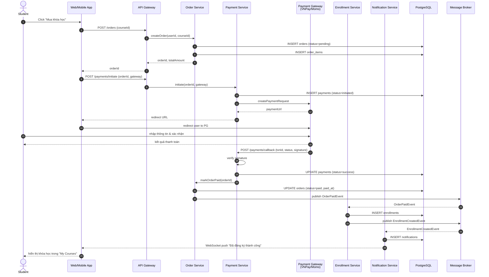
```mermaid
sequenceDiagram
    autonumber
    actor S as Student
    participant FE as Web/Mobile App
    participant GW as API Gateway
    participant ORD as Order Service
    participant PAY as Payment Service
    participant PG as Payment Gateway<br/>(VNPay/Momo)
    participant ENR as Enrollment Service
    participant NOTI as Notification Service
    participant DB as PostgreSQL
    participant MQ as Message Broker

    S->>FE: Click "Mua khóa học"
    FE->>GW: POST /orders (courseId)
    GW->>ORD: createOrder(userId, courseId)
    ORD->>DB: INSERT orders (status=pending)
    ORD->>DB: INSERT order_items
    ORD-->>GW: orderId, totalAmount
    GW-->>FE: orderId

    FE->>GW: POST /payments/initiate (orderId, gateway)
    GW->>PAY: initiate(orderId, gateway)
    PAY->>DB: INSERT payments (status=initiated)
    PAY->>PG: createPaymentRequest
    PG-->>PAY: paymentUrl
    PAY-->>FE: redirect URL

    FE->>PG: redirect user to PG
    S->>PG: nhập thông tin & xác nhận
    PG-->>S: kết quả thanh toán

    PG->>PAY: POST /payments/callback (txnId, status, signature)
    PAY->>PAY: verify signature
    PAY->>DB: UPDATE payments (status=success)
    PAY->>ORD: markOrderPaid(orderId)
    ORD->>DB: UPDATE orders (status=paid, paid_at)
    ORD->>MQ: publish OrderPaidEvent

    MQ-->>ENR: OrderPaidEvent
    ENR->>DB: INSERT enrollments
    ENR->>MQ: publish EnrollmentCreatedEvent

    MQ-->>NOTI: EnrollmentCreatedEvent
    NOTI->>DB: INSERT notifications
    NOTI-->>FE: WebSocket push "Đã đăng ký thành công"

    FE-->>S: hiển thị khóa học trong "My Courses"
```

### 5.2. Học video + tự động ghi note tại timestamp

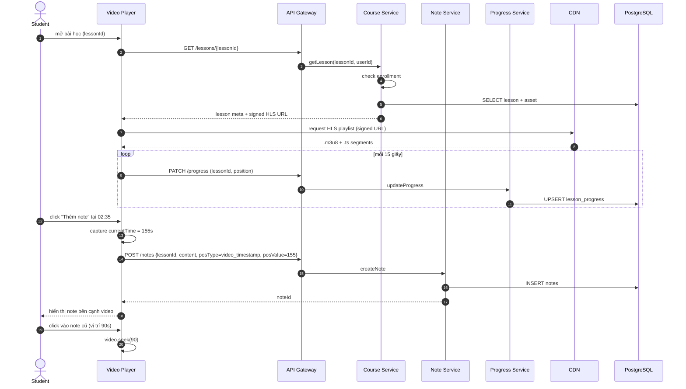
```mermaid
sequenceDiagram
    autonumber
    actor S as Student
    participant FE as Video Player
    participant GW as API Gateway
    participant CS as Course Service
    participant NS as Note Service
    participant PS as Progress Service
    participant CDN as CDN
    participant DB as PostgreSQL

    S->>FE: mở bài học (lessonId)
    FE->>GW: GET /lessons/{lessonId}
    GW->>CS: getLesson(lessonId, userId)
    CS->>CS: check enrollment
    CS->>DB: SELECT lesson + asset
    CS-->>FE: lesson meta + signed HLS URL

    FE->>CDN: request HLS playlist (signed URL)
    CDN-->>FE: .m3u8 + .ts segments

    loop mỗi 15 giây
        FE->>GW: PATCH /progress (lessonId, position)
        GW->>PS: updateProgress
        PS->>DB: UPSERT lesson_progress
    end

    S->>FE: click "Thêm note" tại 02:35
    FE->>FE: capture currentTime = 155s
    FE->>GW: POST /notes {lessonId, content, posType=video_timestamp, posValue=155}
    GW->>NS: createNote
    NS->>DB: INSERT notes
    NS-->>FE: noteId
    FE-->>S: hiển thị note bên cạnh video

    S->>FE: click vào note cũ (vị trí 90s)
    FE->>FE: video.seek(90)
```

### 5.3. Đặt câu hỏi nhanh có gắn vị trí + giảng viên trả lời

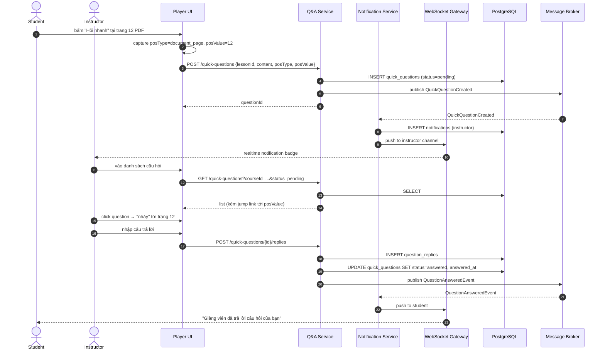
```mermaid
sequenceDiagram
    autonumber
    actor S as Student
    actor I as Instructor
    participant FE as Player UI
    participant QS as Q&A Service
    participant NOTI as Notification Service
    participant WS as WebSocket Gateway
    participant DB as PostgreSQL
    participant MQ as Message Broker

    S->>FE: bấm "Hỏi nhanh" tại trang 12 PDF
    FE->>FE: capture posType=document_page, posValue=12
    FE->>QS: POST /quick-questions {lessonId, content, posType, posValue}
    QS->>DB: INSERT quick_questions (status=pending)
    QS->>MQ: publish QuickQuestionCreated
    QS-->>FE: questionId

    MQ-->>NOTI: QuickQuestionCreated
    NOTI->>DB: INSERT notifications (instructor)
    NOTI->>WS: push to instructor channel
    WS-->>I: realtime notification badge

    I->>FE: vào danh sách câu hỏi
    FE->>QS: GET /quick-questions?courseId=...&status=pending
    QS->>DB: SELECT
    QS-->>FE: list (kèm jump link tới posValue)

    I->>FE: click question → "nhảy" tới trang 12
    I->>FE: nhập câu trả lời
    FE->>QS: POST /quick-questions/{id}/replies
    QS->>DB: INSERT question_replies
    QS->>DB: UPDATE quick_questions SET status=answered, answered_at
    QS->>MQ: publish QuestionAnsweredEvent

    MQ-->>NOTI: QuestionAnsweredEvent
    NOTI->>WS: push to student
    WS-->>S: "Giảng viên đã trả lời câu hỏi của bạn"
```

### 5.4. Chat 1-1 real-time qua WebSocket

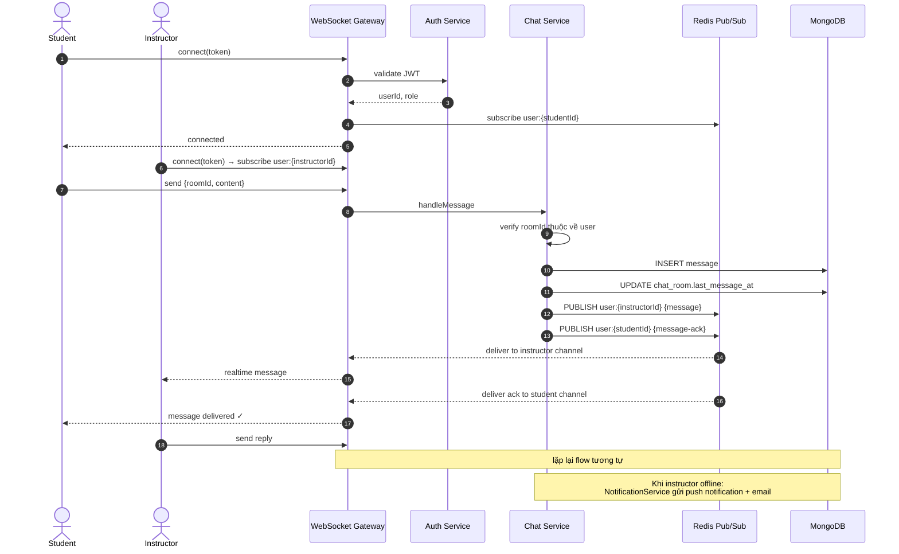
```mermaid
sequenceDiagram
    autonumber
    actor S as Student
    actor I as Instructor
    participant WS as WebSocket Gateway
    participant AUTH as Auth Service
    participant CHAT as Chat Service
    participant REDIS as Redis Pub/Sub
    participant DB as MongoDB

    S->>WS: connect(token)
    WS->>AUTH: validate JWT
    AUTH-->>WS: userId, role
    WS->>REDIS: subscribe user:{studentId}
    WS-->>S: connected

    I->>WS: connect(token) → subscribe user:{instructorId}

    S->>WS: send {roomId, content}
    WS->>CHAT: handleMessage
    CHAT->>CHAT: verify roomId thuộc về user
    CHAT->>DB: INSERT message
    CHAT->>DB: UPDATE chat_room.last_message_at
    CHAT->>REDIS: PUBLISH user:{instructorId} {message}
    CHAT->>REDIS: PUBLISH user:{studentId} {message-ack}
    REDIS-->>WS: deliver to instructor channel
    WS-->>I: realtime message
    REDIS-->>WS: deliver ack to student channel
    WS-->>S: message delivered ✓

    I->>WS: send reply
    Note over WS,DB: lặp lại flow tương tự

    Note over CHAT,DB: Khi instructor offline:<br/>NotificationService gửi push notification + email
```

### 5.5. Đăng bài cộng đồng + bình luận

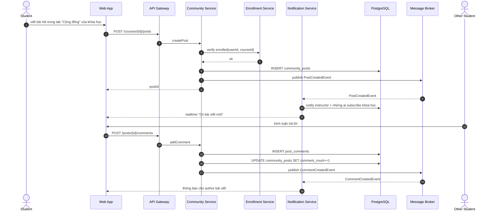
```mermaid
sequenceDiagram
    autonumber
    actor S as Student
    participant FE as Web App
    participant GW as API Gateway
    participant COMM as Community Service
    participant ENR as Enrollment Service
    participant NOTI as Notification Service
    participant DB as PostgreSQL
    participant MQ as Message Broker

    S->>FE: viết bài hỏi trong tab "Cộng đồng" của khóa học
    FE->>GW: POST /courses/{id}/posts
    GW->>COMM: createPost
    COMM->>ENR: verify enrolled(userId, courseId)
    ENR-->>COMM: ok
    COMM->>DB: INSERT community_posts
    COMM->>MQ: publish PostCreatedEvent
    COMM-->>FE: postId

    MQ-->>NOTI: PostCreatedEvent
    NOTI->>DB: notify instructor + những ai subscribe khóa học
    NOTI-->>FE: realtime "Có bài viết mới"

    actor U as Other Student
    U->>FE: bình luận trả lời
    FE->>GW: POST /posts/{id}/comments
    GW->>COMM: addComment
    COMM->>DB: INSERT post_comments
    COMM->>DB: UPDATE community_posts SET comment_count+=1
    COMM->>MQ: publish CommentCreatedEvent

    MQ-->>NOTI: CommentCreatedEvent
    NOTI-->>FE: thông báo cho author bài viết
```

### 5.6. Live Stream (mở rộng tương lai)

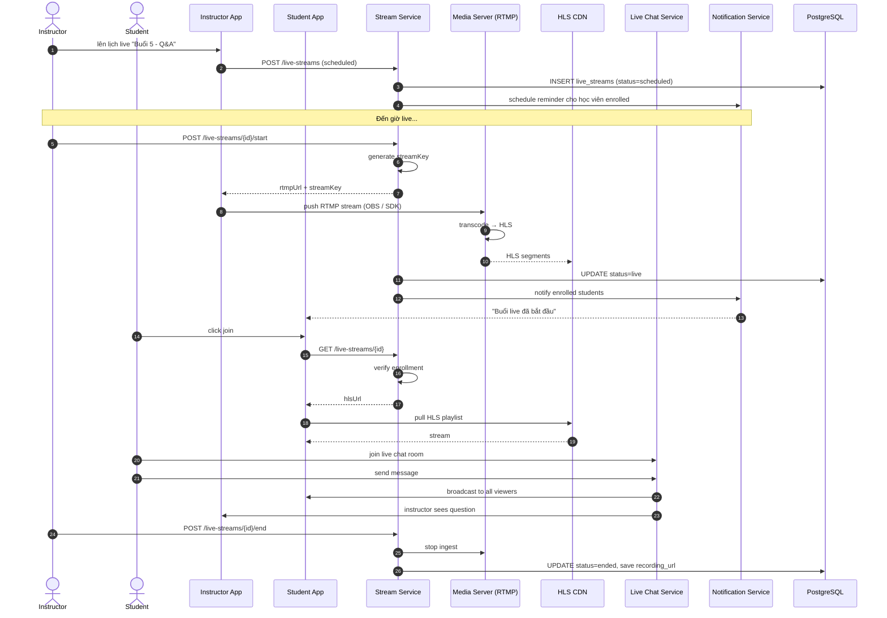
```mermaid
sequenceDiagram
    autonumber
    actor I as Instructor
    actor S as Student
    participant FE_I as Instructor App
    participant FE_S as Student App
    participant STR as Stream Service
    participant MEDIA as Media Server (RTMP)
    participant CDN as HLS CDN
    participant CHAT as Live Chat Service
    participant NOTI as Notification Service
    participant DB as PostgreSQL

    I->>FE_I: lên lịch live "Buổi 5 - Q&A"
    FE_I->>STR: POST /live-streams (scheduled)
    STR->>DB: INSERT live_streams (status=scheduled)
    STR->>NOTI: schedule reminder cho học viên enrolled

    Note over I,NOTI: Đến giờ live...

    I->>STR: POST /live-streams/{id}/start
    STR->>STR: generate streamKey
    STR-->>FE_I: rtmpUrl + streamKey
    FE_I->>MEDIA: push RTMP stream (OBS / SDK)
    MEDIA->>MEDIA: transcode → HLS
    MEDIA-->>CDN: HLS segments
    STR->>DB: UPDATE status=live
    STR->>NOTI: notify enrolled students
    NOTI-->>FE_S: "Buổi live đã bắt đầu"

    S->>FE_S: click join
    FE_S->>STR: GET /live-streams/{id}
    STR->>STR: verify enrollment
    STR-->>FE_S: hlsUrl
    FE_S->>CDN: pull HLS playlist
    CDN-->>FE_S: stream

    S->>CHAT: join live chat room
    S->>CHAT: send message
    CHAT->>FE_S: broadcast to all viewers
    CHAT->>FE_I: instructor sees question

    I->>STR: POST /live-streams/{id}/end
    STR->>MEDIA: stop ingest
    STR->>DB: UPDATE status=ended, save recording_url
```

### 5.7. Admin xem thống kê

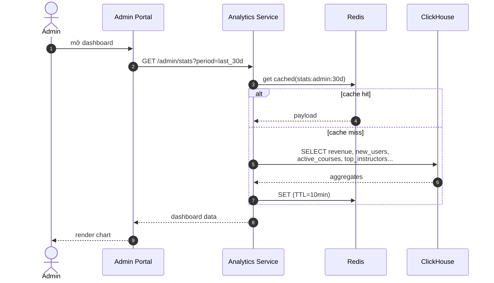
```mermaid
sequenceDiagram
    autonumber
    actor A as Admin
    participant FE as Admin Portal
    participant ANA as Analytics Service
    participant CACHE as Redis
    participant WH as ClickHouse

    A->>FE: mở dashboard
    FE->>ANA: GET /admin/stats?period=last_30d
    ANA->>CACHE: get cached(stats:admin:30d)
    alt cache hit
        CACHE-->>ANA: payload
    else cache miss
        ANA->>WH: SELECT revenue, new_users,<br/>active_courses, top_instructors...
        WH-->>ANA: aggregates
        ANA->>CACHE: SET (TTL=10min)
    end
    ANA-->>FE: dashboard data
    FE-->>A: render chart
```

---

## 6. SƠ ĐỒ PACKAGE (Module Organization)

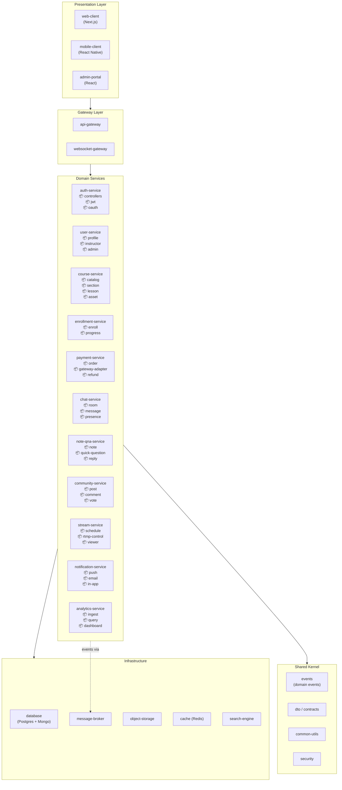
```mermaid
flowchart TB
    subgraph PRES["Presentation Layer"]
        WEB["web-client<br/>(Next.js)"]
        MOB["mobile-client<br/>(React Native)"]
        ADM["admin-portal<br/>(React)"]
    end

    subgraph GATE["Gateway Layer"]
        APIGW["api-gateway"]
        WSGW["websocket-gateway"]
    end

    subgraph DOMAIN["Domain Services"]
        AUTH["auth-service<br/>📦 controllers<br/>📦 jwt<br/>📦 oauth"]
        USER["user-service<br/>📦 profile<br/>📦 instructor<br/>📦 admin"]
        COURSE["course-service<br/>📦 catalog<br/>📦 section<br/>📦 lesson<br/>📦 asset"]
        ENROLL["enrollment-service<br/>📦 enroll<br/>📦 progress"]
        PAY["payment-service<br/>📦 order<br/>📦 gateway-adapter<br/>📦 refund"]
        CHAT["chat-service<br/>📦 room<br/>📦 message<br/>📦 presence"]
        QNA["note-qna-service<br/>📦 note<br/>📦 quick-question<br/>📦 reply"]
        COMM["community-service<br/>📦 post<br/>📦 comment<br/>📦 vote"]
        STREAM["stream-service<br/>📦 schedule<br/>📦 rtmp-control<br/>📦 viewer"]
        NOTI["notification-service<br/>📦 push<br/>📦 email<br/>📦 in-app"]
        ANA["analytics-service<br/>📦 ingest<br/>📦 query<br/>📦 dashboard"]
    end

    subgraph SHARED["Shared Kernel"]
        EVENTS["events<br/>(domain events)"]
        DTO["dto / contracts"]
        UTIL["common-utils"]
        SEC["security"]
    end

    subgraph INFRA["Infrastructure"]
        DB["database<br/>(Postgres + Mongo)"]
        QUEUE["message-broker"]
        STORAGE["object-storage"]
        CACHEINFRA["cache (Redis)"]
        SEARCH["search-engine"]
    end

    PRES --> GATE
    GATE --> DOMAIN
    DOMAIN --> SHARED
    DOMAIN --> INFRA
    DOMAIN -.events via.-> QUEUE
```

---

## 7. SƠ ĐỒ STATE

### 7.1. State của Order

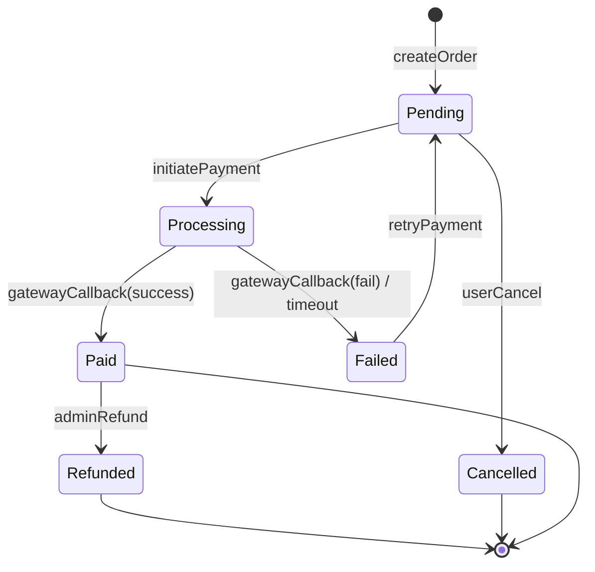
```mermaid
stateDiagram-v2
    [*] --> Pending : createOrder
    Pending --> Processing : initiatePayment
    Processing --> Paid : gatewayCallback(success)
    Processing --> Failed : gatewayCallback(fail) / timeout
    Pending --> Cancelled : userCancel
    Failed --> Pending : retryPayment
    Paid --> Refunded : adminRefund
    Refunded --> [*]
    Cancelled --> [*]
    Paid --> [*]
```

### 7.2. State của Course

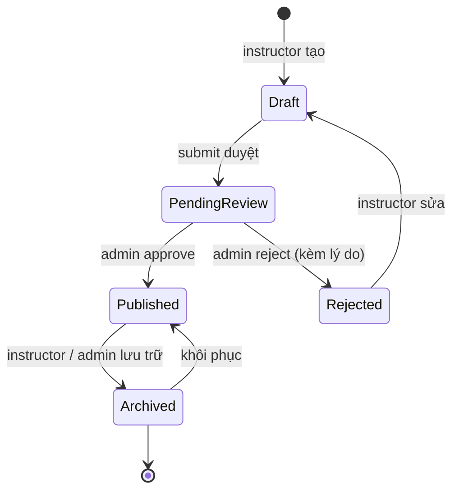
```mermaid
stateDiagram-v2
    [*] --> Draft : instructor tạo
    Draft --> PendingReview : submit duyệt
    PendingReview --> Published : admin approve
    PendingReview --> Rejected : admin reject (kèm lý do)
    Rejected --> Draft : instructor sửa
    Published --> Archived : instructor / admin lưu trữ
    Archived --> Published : khôi phục
    Archived --> [*]
```

### 7.3. State của Quick Question

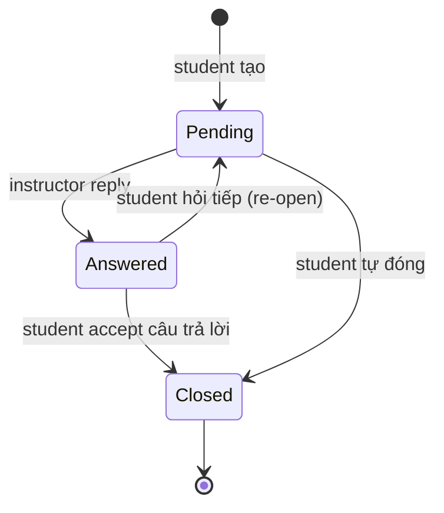
```mermaid
stateDiagram-v2
    [*] --> Pending : student tạo
    Pending --> Answered : instructor reply
    Answered --> Closed : student accept câu trả lời
    Pending --> Closed : student tự đóng
    Answered --> Pending : student hỏi tiếp (re-open)
    Closed --> [*]
```

### 7.4. State của Live Stream

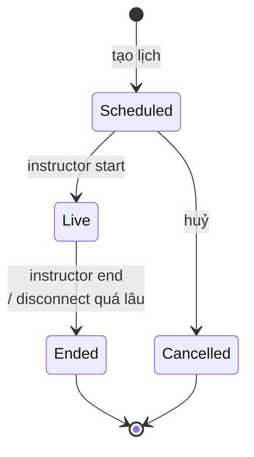
```mermaid
stateDiagram-v2
    [*] --> Scheduled : tạo lịch
    Scheduled --> Live : instructor start
    Scheduled --> Cancelled : huỷ
    Live --> Ended : instructor end<br/>/ disconnect quá lâu
    Ended --> [*]
    Cancelled --> [*]
```

---

## 8. ACTIVITY DIAGRAM

### 8.1. Luồng học viên đăng ký + thanh toán + bắt đầu học

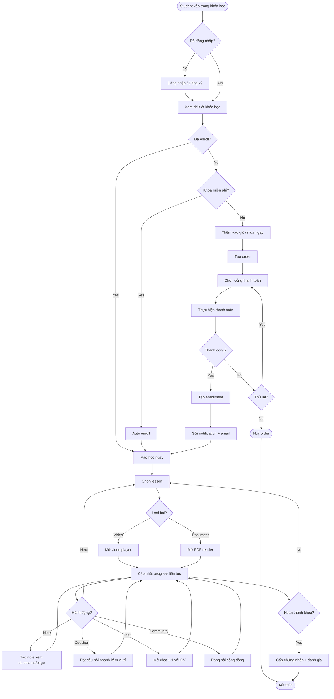
```mermaid
flowchart TD
    Start([Student vào trang khóa học]) --> Check{Đã đăng nhập?}
    Check -- No --> Login[Đăng nhập / Đăng ký]
    Login --> Browse
    Check -- Yes --> Browse[Xem chi tiết khóa học]
    Browse --> Enrolled{Đã enroll?}
    Enrolled -- Yes --> Learn[Vào học ngay]
    Enrolled -- No --> Free{Khóa miễn phí?}
    Free -- Yes --> AutoEnroll[Auto enroll]
    AutoEnroll --> Learn
    Free -- No --> AddCart[Thêm vào giỏ / mua ngay]
    AddCart --> Checkout[Tạo order]
    Checkout --> ChoosePG[Chọn cổng thanh toán]
    ChoosePG --> Pay[Thực hiện thanh toán]
    Pay --> Result{Thành công?}
    Result -- No --> Retry{Thử lại?}
    Retry -- Yes --> ChoosePG
    Retry -- No --> Cancel([Huỷ order])
    Result -- Yes --> CreateEnroll[Tạo enrollment]
    CreateEnroll --> Notify[Gửi notification + email]
    Notify --> Learn
    Learn --> Pick[Chọn lesson]
    Pick --> Type{Loại bài?}
    Type -- Video --> Player[Mở video player]
    Type -- Document --> Reader[Mở PDF reader]
    Player --> Track[Cập nhật progress liên tục]
    Reader --> Track
    Track --> Action{Hành động?}
    Action -- Note --> Note[Tạo note kèm timestamp/page]
    Action -- Question --> Q[Đặt câu hỏi nhanh kèm vị trí]
    Action -- Chat --> Chat[Mở chat 1-1 với GV]
    Action -- Community --> Post[Đăng bài cộng đồng]
    Action -- Next --> Pick
    Note --> Track
    Q --> Track
    Chat --> Track
    Post --> Track
    Cancel --> End([Kết thúc])
    Track --> Done{Hoàn thành khóa?}
    Done -- No --> Pick
    Done -- Yes --> Cert[Cấp chứng nhận + đánh giá]
    Cert --> End
```

### 8.2. Luồng giảng viên tạo & xuất bản khóa học

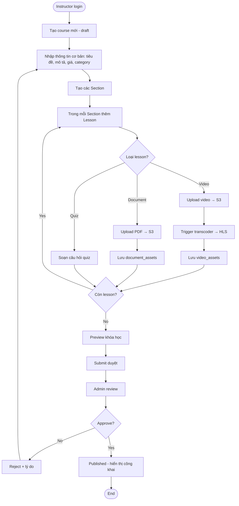
```mermaid
flowchart TD
    A([Instructor login]) --> B[Tạo course mới - draft]
    B --> C[Nhập thông tin cơ bản: tiêu đề, mô tả, giá, category]
    C --> D[Tạo các Section]
    D --> E[Trong mỗi Section thêm Lesson]
    E --> F{Loại lesson?}
    F -- Video --> G[Upload video → S3]
    G --> H[Trigger transcoder → HLS]
    H --> I[Lưu video_assets]
    F -- Document --> J[Upload PDF → S3]
    J --> K[Lưu document_assets]
    F -- Quiz --> L[Soạn câu hỏi quiz]
    I --> M{Còn lesson?}
    K --> M
    L --> M
    M -- Yes --> E
    M -- No --> N[Preview khóa học]
    N --> O[Submit duyệt]
    O --> P[Admin review]
    P --> Q{Approve?}
    Q -- No --> R[Reject + lý do]
    R --> C
    Q -- Yes --> S[Published - hiển thị công khai]
    S --> T([End])
```

---

## 9. SƠ ĐỒ COMPONENT (Logical View)

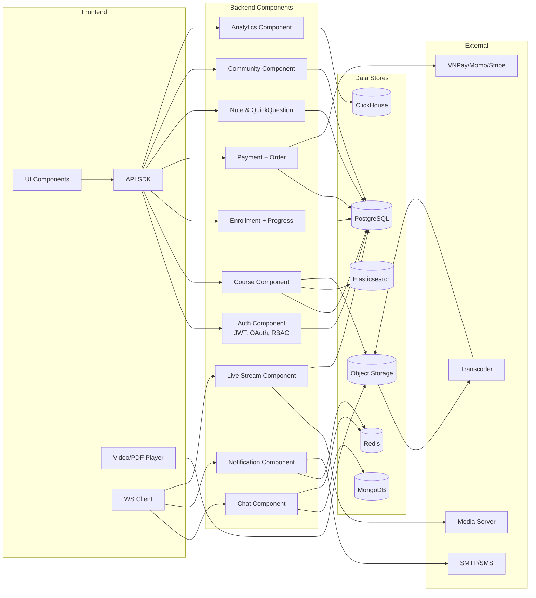
```mermaid
flowchart LR
    subgraph Front["Frontend"]
        UI["UI Components"]
        SDK["API SDK"]
        Player["Video/PDF Player"]
        WSClient["WS Client"]
    end

    subgraph BE["Backend Components"]
        AuthC["Auth Component<br/>JWT, OAuth, RBAC"]
        CourseC["Course Component"]
        EnrollC["Enrollment + Progress"]
        PayC["Payment + Order"]
        ChatC["Chat Component"]
        QnAC["Note & QuickQuestion"]
        CommC["Community Component"]
        StreamC["Live Stream Component"]
        NotiC["Notification Component"]
        AnaC["Analytics Component"]
    end

    subgraph Data["Data Stores"]
        PG[(PostgreSQL)]
        Mongo[(MongoDB)]
        Redis[(Redis)]
        S3[(Object Storage)]
        CH[(ClickHouse)]
        ES[(Elasticsearch)]
    end

    subgraph Ext["External"]
        VN["VNPay/Momo/Stripe"]
        SMTP["SMTP/SMS"]
        TC["Transcoder"]
        RTMP["Media Server"]
    end

    UI --> SDK
    SDK --> AuthC
    SDK --> CourseC
    SDK --> EnrollC
    SDK --> PayC
    SDK --> QnAC
    SDK --> CommC
    SDK --> AnaC
    WSClient --> ChatC
    WSClient --> NotiC
    WSClient --> StreamC

    AuthC --> PG
    CourseC --> PG
    CourseC --> ES
    CourseC --> S3
    EnrollC --> PG
    PayC --> PG
    PayC --> VN
    ChatC --> Mongo
    ChatC --> Redis
    QnAC --> PG
    CommC --> PG
    StreamC --> RTMP
    StreamC --> PG
    NotiC --> Redis
    NotiC --> SMTP
    AnaC --> CH

    Player --> S3
    S3 --> TC
    TC --> S3
```

---

## 10. THỐNG KÊ - METRICS DESIGN

### 10.1. Cho Admin

| Nhóm | Metric | Nguồn |
|------|--------|-------|
| Doanh thu | Tổng doanh thu, doanh thu theo ngày/tuần/tháng, theo cổng thanh toán | `orders`, `payments` |
| Người dùng | Tổng user, user mới, DAU/MAU, tỉ lệ user → student | `users`, event log |
| Khóa học | Tổng khóa, khóa pending, khóa published, top khóa bán chạy | `courses`, `enrollments` |
| Học tập | Tổng giờ xem, tỉ lệ hoàn thành trung bình, top instructor | `lesson_progress`, OLAP |
| Hỗ trợ | Số quick questions chờ trả lời > X giờ | `quick_questions` |

### 10.2. Cho Giảng viên (theo từng khóa)

| Metric | Nguồn |
|--------|-------|
| Số học viên enrolled | `enrollments` |
| Doanh thu của từng khóa | `order_items` + `payments` |
| Tỉ lệ hoàn thành khóa | `lesson_progress` |
| Bài học có drop-off cao | OLAP: count of last `lesson_progress` per enrollment |
| Số câu hỏi nhanh chưa trả lời | `quick_questions WHERE status='pending'` |
| Đánh giá trung bình + biểu đồ rating | `reviews` |
| Số tin nhắn chat chưa đọc | `messages` |

Cách triển khai:
- **Real-time gần đúng**: Service emit Kafka event → Analytics Service cập nhật ClickHouse + cache snapshot vào Redis (TTL 5–15 phút).
- **Báo cáo sâu**: Job batch hàng đêm tính các bảng aggregate (`daily_revenue`, `course_funnel`, `lesson_dropoff`).

---

## 11. BẢO MẬT & PHÂN QUYỀN (RBAC)

| Role | Quyền chính |
|------|-------------|
| Guest | Xem khóa học public, xem preview lesson |
| Student | + Mua khóa, học, note, quick-question, chat, post community |
| Instructor | + Tạo/sửa khóa của mình, trả lời chat/Q&A, xem stats khóa của mình, live stream |
| Admin | Toàn quyền + duyệt course, ban user, refund, xem stats hệ thống |

Các điểm bảo mật cần lưu ý:
- **JWT + Refresh token**, lưu refresh token trong Redis kèm device fingerprint.
- **Signed URL** cho video/document trên CDN — chống share link.
- **HLS encryption (AES-128)** + token đổi mới định kỳ — chống tải video lậu.
- **Rate limiting** ở API Gateway (login, OTP, comment) bằng Redis.
- **Verify webhook signature** từ cổng thanh toán (HMAC).
- **Idempotency key** cho `POST /orders`, `POST /payments` để tránh tạo trùng khi user click nhiều lần.
- **Row-level access**: học viên chỉ truy cập lesson của khóa đã enroll; chat chỉ load message của room mà user thuộc về.

---

## 12. ROADMAP TRIỂN KHAI ĐỀ XUẤT

| Giai đoạn | Phạm vi |
|-----------|--------|
| **Phase 1 — MVP** | Auth, Course catalog, Enrollment, Payment (1 cổng), Video lesson, Note + Quick Question, Chat 1-1, Review |
| **Phase 2** | Community, Document lesson, Quiz, Notification đa kênh, thống kê instructor |
| **Phase 3** | Live Stream, đa cổng thanh toán, mobile app, recommend engine |
| **Phase 4** | Multi-tenant cho doanh nghiệp, SCORM/xAPI, cấp chứng chỉ blockchain (tuỳ) |

---

## PHỤ LỤC: Enums chính

```text
UserRole         = student | instructor | admin
UserStatus       = active | locked | deleted
CourseStatus     = draft | pending | published | archived | rejected
CourseLevel      = beginner | intermediate | advanced
LessonType       = video | document | quiz
PositionType     = video_timestamp | document_page | none
QuestionStatus   = pending | answered | closed
EnrollStatus     = active | completed | cancelled
OrderStatus      = pending | processing | paid | failed | cancelled | refunded
PaymentStatus    = initiated | success | failed | refunded
PostType         = question | discussion | announcement
PostStatus       = active | hidden | deleted
MessageType      = text | image | file | system
StreamStatus     = scheduled | live | ended | cancelled
NotifType        = enrollment | payment | quick_question | chat | community | live | system
```
